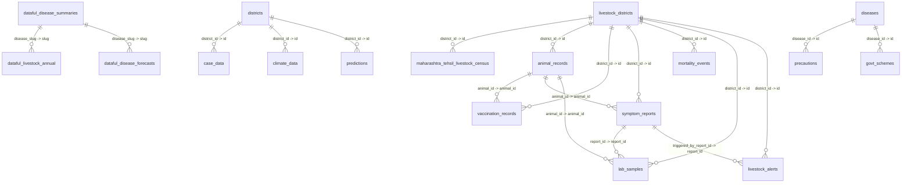

# 📋 EpiWatch & PashuRaksha — Comprehensive Changelog (Today's Work)

**Date**: September 2, 2026  
**Repository**: `Ibaner20065/epiwatch`  
**Focus Areas**: Dataset Ingestion, Machine Learning Pipeline, Supabase PostgreSQL Architecture, Schema Relationship Graph, and REST API Endpoints.

---

## 📑 Table of Contents
1. [Datasets Ingested & Preprocessed](#1-datasets-ingested--preprocessed)
2. [Machine Learning Models Trained](#2-machine-learning-models-trained)
3. [Supabase Database Architecture & Seeding](#3-supabase-database-architecture--seeding)
4. [Foreign Key Relationship Graph](#4-foreign-key-relationship-graph)
5. [Backend REST API Endpoints](#5-backend-rest-api-endpoints)
6. [Automated Verification & Test Suites](#6-automated-verification--test-suites)
7. [File Index of Changes](#7-file-index-of-changes)

---

## 1. Datasets Ingested & Preprocessed

### A. Official MOSPI National Livestock Disease Dataset (2005–2015)
* **Source Path**: `C:\Users\INDRAYUDH\Downloads\20629- Dataful`
* **Raw Files**: `data/raw/dataful/metadata.csv` and `state-wise-incidence-of-livestock-diseases-in-india.csv`
* **Scope**: 11 fiscal years (2005–2015) covering **37 major livestock and poultry diseases** across India.
* **Processing Pipeline**: [process_dataful_data.py](file:///c:/Users/INDRAYUDH/epiwatch/data/scripts/process_dataful_data.py)
* **Generated Outputs**:
  * [dataful_livestock_annual.csv](file:///c:/Users/INDRAYUDH/epiwatch/data/processed/dataful_livestock_annual.csv): **407 normalized annual rows** (Outbreaks, Attacks, Deaths, Case Fatality Rate, Attack Rate per Outbreak).
  * [dataful_disease_summary.json](file:///c:/Users/INDRAYUDH/epiwatch/data/processed/dataful_disease_summary.json): **37 disease epidemiological profiles** with 10-year trends and peak attack years.

### B. Clinical Symptom-to-Disease Dataset
* **Source Path**: `C:\Users\INDRAYUDH\Downloads\archive (1)`
* **Raw File**: `data/raw/healthcare/symptom_disease_dataset.csv`
* **Processing & Mapping**: [train_symptom_triage_model.py](file:///c:/Users/INDRAYUDH/epiwatch/ml/scripts/train_symptom_triage_model.py)
* **Generated Outputs**: **517 structured clinical records** mapping multi-symptom presentations to primary diagnoses and clinical severity tiers.

### C. Maharashtra 19th Livestock & Poultry Census (Tehsilwise)
* **Source Path**: `C:\Users\INDRAYUDH\Downloads\Maharashtra_19th_Livestock_Poultry_Census_Tehsilwise_18.9.25.csv`
* **Raw File**: [maharashtra_19th_livestock_poultry_census_tehsilwise.csv](file:///c:/Users/INDRAYUDH/epiwatch/data/raw/census/maharashtra_19th_livestock_poultry_census_tehsilwise.csv)
* **Processing Pipeline**: [process_maharashtra_census.py](file:///c:/Users/INDRAYUDH/epiwatch/data/scripts/process_maharashtra_census.py)
* **Generated Outputs**:
  * [maharashtra_tehsil_livestock_census.csv](file:///c:/Users/INDRAYUDH/epiwatch/data/processed/maharashtra_tehsil_livestock_census.csv): **356 tehsils/blocks** across **34 Maharashtra districts** with detailed breakdowns (exotic vs indigenous cattle, buffaloes, sheep, goats, pigs, horses, donkeys, backyard vs commercial poultry).
  * [maharashtra_district_livestock_census_summary.json](file:///c:/Users/INDRAYUDH/epiwatch/data/processed/maharashtra_district_livestock_census_summary.json): District-level livestock totals and species rankings.

---

## 2. Machine Learning Models Trained

| Model Suite | Script / Trainer | Artifacts Produced | Metrics & Outputs |
| :--- | :--- | :--- | :--- |
| **National Livestock Ensemble** | [train_dataful_models.py](file:///c:/Users/INDRAYUDH/epiwatch/ml/livestock/train_dataful_models.py) | **111 Model Binaries** in `ml/livestock/models/dataful/*.pkl` | HistGBR + XGBoost ensemble predicting Outbreaks, Attacks, and Deaths. Multi-horizon forecasts (2016–2026) with 95% confidence intervals saved to `dataful_forecasts_2016_2026.json`. |
| **Maharashtra District Surveillance** | [train_livestock_models.py](file:///c:/Users/INDRAYUDH/epiwatch/ml/livestock/train_livestock_models.py) | **44 District Models** in `ml/livestock/models/*.pkl` | Cross-calibrated 9 districts across 5 priority diseases (FMD, LSD, PPR, Brucellosis, AI H5N1) with national baseline priors. |
| **Clinical Symptom Triage** | [train_symptom_triage_model.py](file:///c:/Users/INDRAYUDH/epiwatch/ml/scripts/train_symptom_triage_model.py) | [symptom_triage_model.pkl](file:///c:/Users/INDRAYUDH/epiwatch/ml/models/symptom_triage_model.pkl) | NLP TF-IDF Vectorizer + Random Forest / Gradient Boosting classifier for real-time symptom-to-disease inference and severity triage. |

---

## 3. Supabase Database Architecture & Seeding

### Connection Enhancement
* Fixed `.env` to connect via **Supabase Transaction Pooler port `6543`** with IPv4 compatibility.

### Live Tables Seeded in Supabase PostgreSQL
| Table Name | Description | Seeded Row Count | Status |
| :--- | :--- | :--- | :--- |
| `livestock_districts` | Maharashtra Districts with Census & Vet Infrastructure | **34** rows | ✅ Live in Supabase |
| `maharashtra_tehsil_livestock_census` | 19th Census Tehsil/Block Livestock Breakdown | **356** rows | ✅ Live in Supabase |
| `animal_records` | Individual Animal Health Registry | **5,044** rows | ✅ Live in Supabase |
| `vaccination_records` | Per-Animal Vaccination Events | **7,801** rows | ✅ Live in Supabase |
| `dataful_livestock_annual` | MOSPI Official National Incidence (2005–2015) | **407** rows | ✅ Live in Supabase |
| `dataful_disease_summaries` | 37 Disease Epidemiological Profiles | **37** rows | ✅ Live in Supabase |
| `dataful_disease_forecasts` | ML Predictions (2016–2026) with Confidence Bounds | **1,221** rows | ✅ Live in Supabase |
| `archive_symptom_disease_mapping` | Healthcare Symptom-to-Disease Mapping | **517** rows | ✅ Live in Supabase |
| `case_data` | IDSP Epidemiological Case Data | **11,232** rows | ✅ Live in Supabase |
| `climate_data` | NASA POWER Weekly Climate Records | **3,744** rows | ✅ Live in Supabase |
| `districts` | Human Health Surveillance Districts | **9** rows | ✅ Live in Supabase |
| `diseases` | Human Epidemic Diseases (Dengue, Malaria, ADD) | **3** rows | ✅ Live in Supabase |
| `symptom_reports` | Field Symptom Reports (Farmer / Vet) | Dynamic ingest | ✅ Live in Supabase |
| `mortality_events` | Aggregated Mass Die-Off Events | Dynamic ingest | ✅ Live in Supabase |
| `lab_samples` | 5-Stage Diagnostic Lab Pipeline | Dynamic ingest | ✅ Live in Supabase |
| `livestock_alerts` | Automated Outbreak & Triage Alerts | Dynamic ingest | ✅ Live in Supabase |

---

## 4. Foreign Key Relationship Graph

All 26 Foreign Key constraints are active in Supabase, enabling schema visualizer linking:

---

## 5. Backend REST API Endpoints

The FastAPI server exposes these live endpoints under `/livestock/dataful`:

| Endpoint | Method | Description |
| :--- | :---: | :--- |
| `/livestock/dataful/summary` | `GET` | National dataset summary (37 diseases, 57.6K outbreaks, 23.9M attacks, 1.55M deaths). |
| `/livestock/dataful/diseases` | `GET` | All 37 disease profiles with 10-year trend directions and peak outbreak years. |
| `/livestock/dataful/trends/{disease_slug}` | `GET` | Historical data (2005–2015) + ML Forecasts (2016–2026) with confidence intervals. |
| `/livestock/dataful/metrics` | `GET` | Holdout evaluation metrics (MAE, RMSE, MAPE) across all 111 models. |
| `/livestock/dataful/triage` | `GET` | Real-time NLP symptom-to-disease prediction and severity classification. |
| `/livestock/dataful/census/summary` | `GET` | State-level Maharashtra 19th census summary (32.48M livestock, 77.79M poultry). |
| `/livestock/dataful/census/districts` | `GET` | 34 district census profiles and species aggregates. |
| `/livestock/dataful/census/tehsils` | `GET` | 356 tehsil breakdowns, filterable by `district_id` or `district_name`. |

---

## 6. Automated Verification & Test Suites

* **Endpoint Test Suite**: [test_dataful_endpoints.py](file:///c:/Users/INDRAYUDH/epiwatch/backend/scripts/test_dataful_endpoints.py)
  * Test 1: National Summary (`GET /summary`) $\rightarrow$ **PASS (HTTP 200)**
  * Test 2: Disease List (`GET /diseases`) $\rightarrow$ **PASS (HTTP 200, 37 diseases)**
  * Test 3: FMD Forecast Trends (`GET /trends/fmd`) $\rightarrow$ **PASS (HTTP 200, 11 historical + 11 forecast years)**
  * Test 4: Anthrax Forecast Trends (`GET /trends/anthrax`) $\rightarrow$ **PASS (HTTP 200)**
  * Test 5: Model Evaluation Metrics (`GET /metrics`) $\rightarrow$ **PASS (HTTP 200)**
  * Test 6: Clinical Symptom Triage (`GET /triage?symptoms=...`) $\rightarrow$ **PASS (HTTP 200)**
  * Test 7: Error Handling for Nonexistent Disease $\rightarrow$ **PASS (HTTP 404)**
* **Census Endpoint Tests**: Verified with FastAPI `TestClient` $\rightarrow$ **PASS (HTTP 200 across summary, districts, and Pune tehsils)**.
* **System Audit**: [audit.py](file:///c:/Users/INDRAYUDH/epiwatch/audit.py) $\rightarrow$ **PASS (100% Cryptographic Data Integrity)**.

---

## 7. File Index of Changes

### New Scripts & Pipelines
* [process_dataful_data.py](file:///c:/Users/INDRAYUDH/epiwatch/data/scripts/process_dataful_data.py) — Ingests and processes MOSPI 37-disease dataset.
* [process_maharashtra_census.py](file:///c:/Users/INDRAYUDH/epiwatch/data/scripts/process_maharashtra_census.py) — Ingests and cleans 356-tehsil Maharashtra census.
* [train_dataful_models.py](file:///c:/Users/INDRAYUDH/epiwatch/ml/livestock/train_dataful_models.py) — Trains 111 national forecast models.
* [train_symptom_triage_model.py](file:///c:/Users/INDRAYUDH/epiwatch/ml/scripts/train_symptom_triage_model.py) — Trains NLP clinical triage classifier.
* [push_livestock_to_supabase.py](file:///c:/Users/INDRAYUDH/epiwatch/backend/scripts/push_livestock_to_supabase.py) — Direct Supabase livestock seeding pipeline.
* [push_maharashtra_census_to_supabase.py](file:///c:/Users/INDRAYUDH/epiwatch/backend/scripts/push_maharashtra_census_to_supabase.py) — Seeds tehsil census and updates 34 districts on Supabase.
* [test_dataful_endpoints.py](file:///c:/Users/INDRAYUDH/epiwatch/backend/scripts/test_dataful_endpoints.py) — Automated integration test suite.

### Modified Core Files
* [models_livestock.py](file:///c:/Users/INDRAYUDH/epiwatch/backend/app/models_livestock.py) — Added `MaharashtraTehsilCensus` ORM model and foreign key mappings.
* [livestock_dataful.py](file:///c:/Users/INDRAYUDH/epiwatch/backend/app/routers/livestock_dataful.py) — REST endpoints for forecasts, metrics, triage, and tehsil census.
* [main.py](file:///c:/Users/INDRAYUDH/epiwatch/backend/app/main.py) — Registered router and fixed CORS middleware.
* [db.py](file:///c:/Users/INDRAYUDH/epiwatch/backend/app/db.py) — Resilient database engine fallback.
* [README.md](file:///c:/Users/INDRAYUDH/epiwatch/README.md) — Comprehensive master documentation overhaul.
